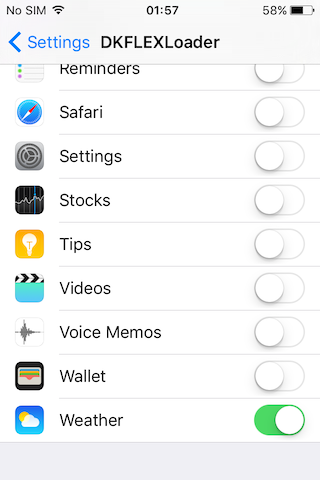
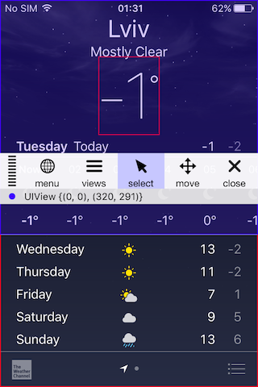

# DKFLEXLoader

Script and CydiaSubstrate tweak which helps to build [FLEX](https://github.com/Flipboard/FLEX) .dylib and inject it into the system and 3rd-party apps. Requires [Theos](http://iphonedevwiki.net/index.php/Theos/Setup).

#### How-to

1. `chomod +x build_dylib.sh`
2. `./build_dylib.sh`   
3. `make package`

#### Some screenshots

   
   ​
   
   ​
   
   ​